# Basics 

A basic workshop to learn the world of git

Note:
Everyone needs to have the following things before we start the class
* git 
* github account

---

### What is git?

- Short history
- Alternatives (SVN, Mercurial, etc)
- Distributed version control

Note:
* What is version control? Distributed version controls and others. 

+++

#### Distributed vesion control system

It looks something like this 

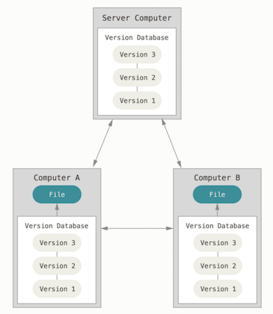

Note:
Maybe I should mention the other types of systems and give examples

+++

Centralized Version Control

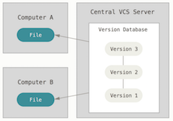

Local Version Control

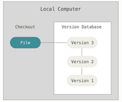

Note:
Give a short story on how I used to use dropbox for this

---

## Let's do some coding

---

### Configuration

```bash
git init test
cd test

git config --local user.name andres
git config --local user.email andres.jorquera@kairosds.com

ls .git
HEAD    config    description    hooks    info    objects    refs
```

Note: 
Talk about why configuring email and name is important

---

### First commits

1. Create the following files: .gitignore, README.md

2. Stage files 

	```bash
	git status
	git add .gitignore README.md
	git status
	```

3. Commit 

	```bash
	git commit
	git status
	```

4. Add message to README.md and commit

Note:
* Explain the utility of both files. 
* A possible message could be, your name and a description about yourself

+++

We have something like...

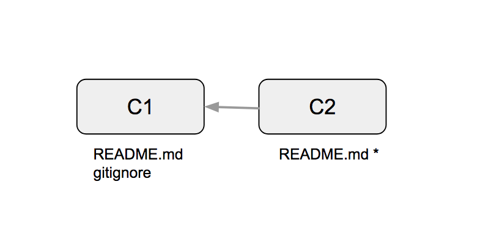

---

### Branching and merging

1. Create a new branch

	```
	git branch
	git branch -b feat/tests
	git branch
	```

2. Create a simple test in test/basic.js

	```javascript
	const assert = require('assert');

	describe('git basics challenge', ()=> {
		it('should return the must basic test of all', () => {
			assert(true);
		});
	});
	```

+++

3. Go back to master and do a bit of work...

	```bash
	git checkout master
	git branch
	
	#working...

	git commit
	```

4. Merge test branch

	```
	git merge feat/test
	```

Note: 
A bit of work is, things that you like as a hobby

+++

This is what we have done...

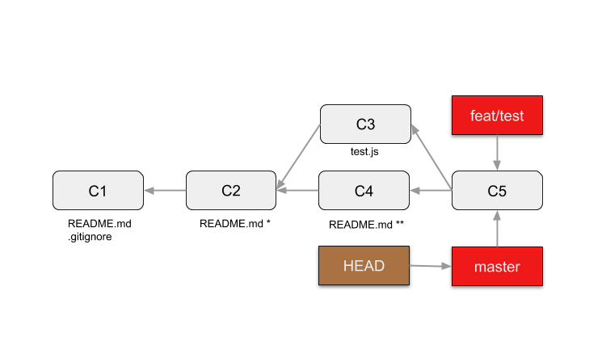

+++

### Merge Strategies

Fast forward

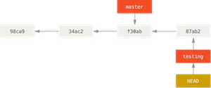

Recursive strategy

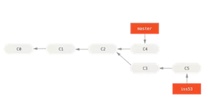

Note:
Introducing branch and HEAD in graph

---

### Remotes

1. Create repository in github

2. Add remote

	```bash
	git remote add origin https://github.com/ajorquera/git-basics.git
	git remote -v
	```

3. Push
	```bash
	git push
	git push -u origin master
	```

+++

#### Multiple remotes

```bash
git remote add otherRepo https://github.com/ajorquera/git-basics.git
git fetch otherRepo
git remote -v
git remote show otherRepo
```

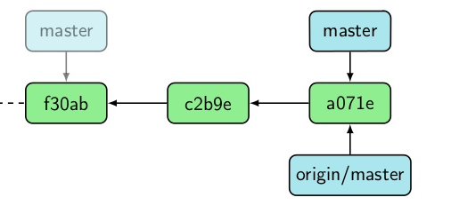

Note:
* Explain pull vs fetch

+++

#### Git hosting

- Github 
- Bitbucket 
- Gitlab
- Microsoft Visual Studio Team Services

---

### Merge Conflicts
	
1. Add new remote
  
	```bash
	git remote add team https://github.com/ajorquera/git-basics.git
	```

2. New branch and push

	```bash
	git checkout -b feat/andres-someone
	git push -u team feat/andres-someone
	```
+++

3. Do some work and commit 
	```bash
	#do work..

	git add README.md
	git commit
	git push

	git status
	git pull
	git status

	#resolve conflicts
	git add 
	git push
	```

```
git remote add origin https://github.com/ajorquera/git-basics.git
```

Note: 
Work in couples in a single branch. Mergin your work into a single README.md

+++

#### Resolving conflics

- Text editors
- IDE
- Applications

---

### Tagging 

- Lightweigh

	```bash
	git tag 1.0.0
	```

- Annotated
	```bash
	git tag 1.0.0
	git push --tags 
	```

Note: 
Maybe we could talk about NPM version and version control
---

### Visualizing git

* IDE plugins
* Web Interfaces
* Applications
* Git

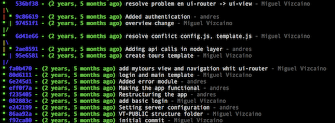

```
git config --local alias.lg "log --graph --abbrev-commit --decorate --format=format:'%C(bold blue)%h%C(reset) - %C(bold green)(%ar)%C(reset) %C(white)%s%C(reset) %C(dim white)- %an%C(reset)%C(auto)%d%C(reset)' --all"
```

---

## Core Basics

+++

### Snapshots

This is the most simplified git you have seen:

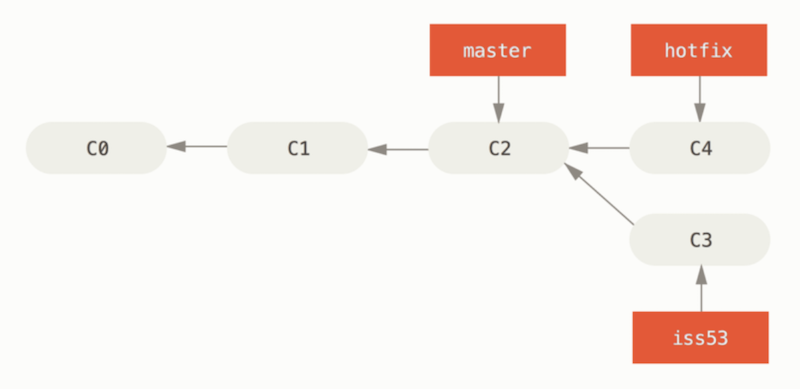

But, how about we go deeper...

Note:
Talk about the meaning of snapshots. 

+++

#### Database - commit, tree and blob

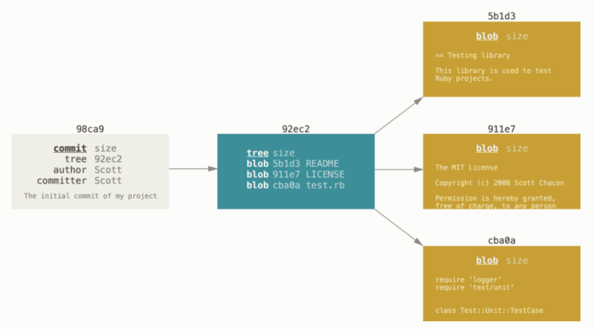

+++

### References 

Branches, HEAD, tags, remotes

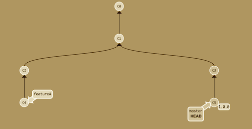

+++

#### Integrity

Cryptographic hash function SHA-1

```
shasum README.md
dd122581c8cd44d0227f9c305581ffcb4b6f1b46 README.md

echo " " >> README.md

shasum README.md
da39a3ee5e6b4b0d3255bfef95601890afd80709 README.md
```

+++

### States

```
echo "Hello" >> README.md
git add README.md
git commit -m "my commit message" 
```

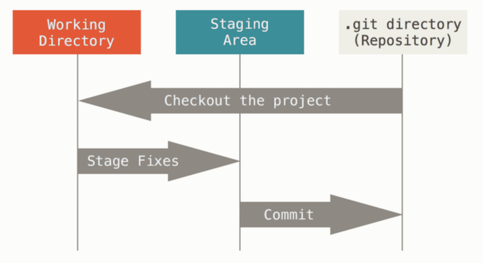

---

### Homework

Let's put your skills to the test. Your challenge as a student is to complete the following tasks that are describe in the folloging [wiki](https://github.com/ajorquera/git-basics/wiki/homework)

--- 

## Part 2

---

## Content

- Git rebase
- Rebase vs Merge
- Git workflows
- Git useful commands
- More documentation


